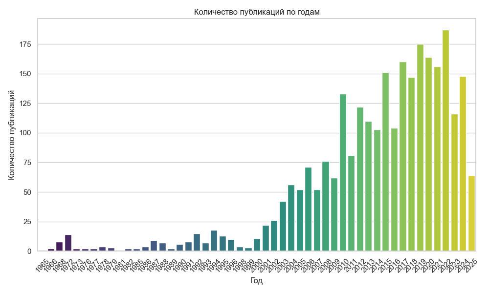
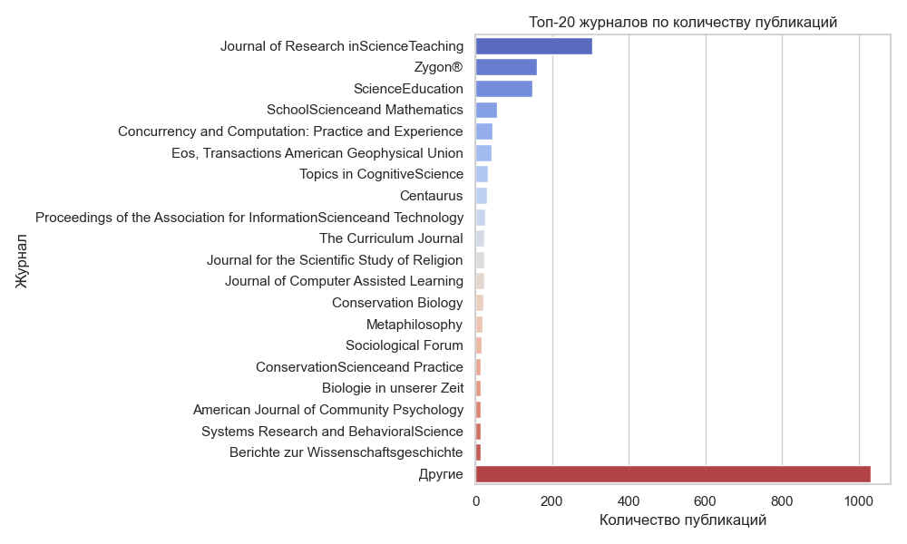
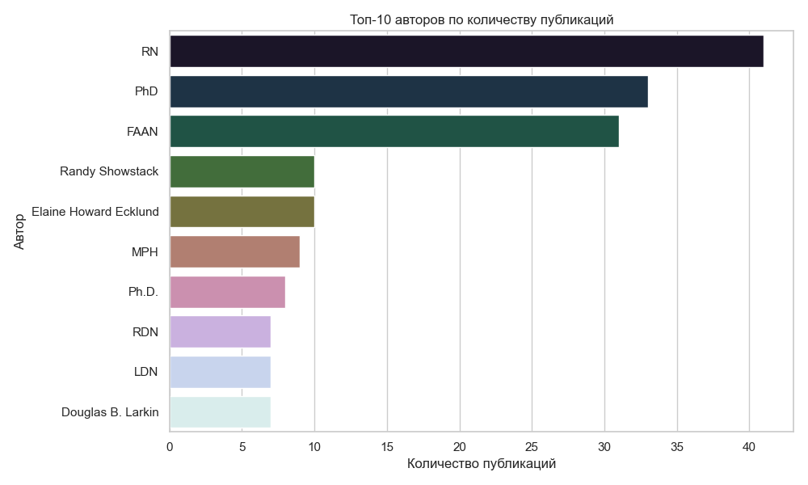

# 📊 Анализ публикаций с Wiley Online Library

Скрипт на Python автоматически парсит научные публикации с сайта [Wiley Online Library](https://onlinelibrary.wiley.com), сохраняет их в `CSV`, а затем визуализирует основные метрики.

## 🧩 Используемые технологии

- `Selenium + undetected-chromedriver` — для автоматического сбора данных
- `BeautifulSoup` — парсинг HTML
- `Pandas` — работа с таблицами
- `Matplotlib / Seaborn` — визуализация

## ⚙️ Параметры поиска

- Поддержка фильтров по дате: все, последний год/месяц/6 мес., произвольный диапазон
- Возможность выбора поля поиска: заголовок, ключевые слова, автор и т.д.

---

## 📁 Результаты

### 1. Количество публикаций по годам

---

### 2. Топ-20 журналов по числу публикаций

---

### 3. Топ-10 выпусков по публикациям

---

### 4. Топ-10 авторов по публикационной активности

---

## 📦 Файл CSV

После запуска парсера формируется файл:
